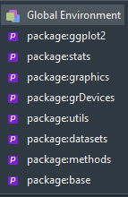

```{r setup, include=FALSE}
knitr::opts_chunk$set(echo = TRUE)
```

## Notion d'environnement

*R est un language orienté objet ce qui veut dire que les variables et les fonctions sont des objets*

- Un environement sert comme espace de stockage de ces objets
- un objet = un nom (ex:a) associé à une valeure (ex:1)
- on distingue l'environement locale et global
- R sauvegarde automatiquement une copie de l'environement global en fermant R

## Variables globales 

- Déclarées hors d'une fonction
- Peuvent être accedées et modifiées à partir de n'importe où dans le programme
- Assigner une variable globale de l'intérieur d'une fonction avec 
```{r eval=FALSE, include=TRUE}
a <<- 2
```
- Fonction "ls()" permet d'identifier toutes les variables dans le workspace actuel
- Fonction "assign" permet de definir l'environnement d'affectation d'une variable globale

```{r eval=FALSE, include=TRUE}
       envir = .GlobalEnv
        assign(x = "x", 
        value = x + 1, 
        envir = .GlobalEnv)
```


## Supprimer des variables
- Supprimer les variables 
```{r eval=FALSE, include=TRUE}
 rm(list=ls())
```
- Supprimer les fonctions en laissant les variables
```{r eval=FALSE, include=TRUE}
  rm(list=lsf.str())
```
- Supprimer les variables en laissant les fonctions
```{r eval=FALSE, include=TRUE}
  rm(list = setdiff(ls(), lsf.str()))
```
  


## Variables locales
- Variables locales masquent les variables globales de mÊme nom 
- Déclarées à l'intérieur d'une fonction, dont on peut chercher au sein de leur environnement avec : 

```{r eval=FALSE, include=TRUE}
get('var', envir=test.env)
```


## Cas particulier: Package

- Utiliser un package avec library revient à travailler avec un nouvel environnement
- cet environement doit être rechargé à chaque ouverture de r
- il contient les fonctions et les données du package




## Parametres de fonctions


```{r }

a<-1

fun<-function(x){
a<-10
return(x+a)
}
fun(1)
a

```


## Parametres de fonctions

```{r }

a<-1

fun<-function(x){

return(x+a)
}
fun(1)
a

```

## Parametres de fonctions

```{r }

a<-1

fun<-function(x){
a<<-10
return(x+a)
}
fun(1)
a

```


## Parametres de fonctions

```{r }

a<-1
x<-100
fun<-function(x=1){

return(x+a)
}
fun()
a

```

## Manipuler un environement

*On peut creer et remplir d'autres environements*


```{r }
a<-1
env2<-new.env()
assign("a",2,envir=env2)

a

get("a",envir=env2)

env2$b<-2
env2$b
```

## Interet d'un nouvel environement
