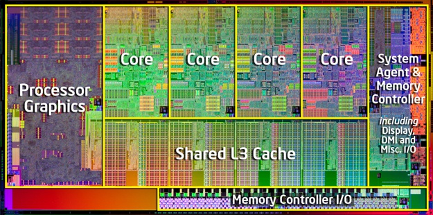

```{r setup, include=FALSE}
knitr::opts_chunk$set(echo = TRUE)
```

## Le processeur
- Est le composant du PC qui effectue les calculs et instructions 
- Il est divisé en coeurs (core)
- un coeur ne peut traiter q'une instruction à la fois
- R utilise par défaut qu'un coeur
- Utiliser plusieurs coeurs peut augmenter la vitesse de calcul




## La parallélisation
- Est un moyen efficace mais situationnel de reduire le temps de calcul
- Repose sur deux packages
```{r ,include=TRUE}
library(foreach)
library(doParallel)
```


## Boucle foreach
Légèrement différente de la boucle `for` classique. Utilisable sans paralléliser avec l'opérateur `%do%`.
```{r foreach}
x <- foreach(i = 1:3) %do% sqrt(i)
x
```

## Boucle foreach
Contrairement à `for` retourne des résultats, stockés par défaut dans une liste.

Possibilité de changer la façon dont les résultats sont assemblés en passant une fonction à `.combine` : 
```{r combine}
x <- foreach(a = 1:3, b = rep(10,3), .combine = c) %do% (a + b)
x
```

Remarque : on peut itérer plusieurs variables comme un mapply

## Boucle foreach
Retourner un data frame : 
```{r combine2}
x <- foreach(m = c(5,10,15), sdev = 1:3, .combine = cbind) %do% {
  rnorm(4, m, sdev)  
}
x
```

Autre subtilité: il faut spécifier les packages utilisés au sein de la boucle avec l'argument `.package=`


## Doparallel
*Obtenir le nombre de coeurs de la machine* 
```{r}
nbcoeur <- detectCores() # intel i5 : 4 coeurs
```

*Il faut tout d'abord lancer une session de R par coeur*
```{r}
clust <- makeCluster(nbcoeur-1) # recommandé
```
*Et que ces autres sessions soient detectées par foreach*
```{r}
registerDoParallel(clust)
```

*Renvoie le nombre de coeur qui seront utilisés*
```{r}
getDoParWorkers()
```
*Stopper le clustering*
```{r}
stopCluster(clust)
```


## %dopar%

Pour paralléliser: remplacer `%do%` par `%dopar%` 

## Parallélisation efficace
*Efficace si: *

- l'opération à répéter est longue (opération à droite de `%dopar%` est longue à calculer)
- le nombre d'itération est un multiple du nombre de coeurs utilisés
```{r, include=TRUE,eval=FALSE}
foreach(i=(petit ou grand vecteur))%dopar%{Gros modèle enervé}
foreach(i=1:3,) %dopar%{glm(NDVI~PP+TEMP,datanasa[[i]],
                                  family=binomial(logit))}
```
```{r, include=TRUE,eval=FALSE}
formula1=formula(NDVI~PP)
formula2=formula(NDVI~PP*TEMP)
formula3=formula(NDVI~PP*TEMP + SNOW)
listform=list(formula1,formula2,formula3)
foreach(F=listform) %dopar%{glm(F,datanasa[[i]],
                                  family=binomial(logit))}
```


## Parallélisation 

*Contre productif si:*

- le temps de calcul est déja court
- le calcul est long à cause d'un grand nombre d'itérations de la boucle, mais qu'une seule itération est très rapide à calculer
```{r, include=TRUE,eval=FALSE}
foreach(i=1:GROSNOMBRE,.combine = "c"){ Opération ultra rapide}

foreach(i=1:100000,.combine = "c"){ 1+i}
```

## Exemples

Inefficacité de la parallélisation
```{r uselessforeach, include=TRUE, eval = FALSE}
res2 <- numeric()
dft <- data.frame(time_foreach = numeric(), time_for = numeric())
for (i in 1:20) {
  tfe <- system.time(
    res <- foreach(j = 1:1000, .combine = c) %dopar% sqrt(j)
    )[[3]]
  
  tf <- system.time(
    for(k in 1:1000){
      res2  <- c(res2, sqrt(k))
      }
    )[[3]]
  
  dft[i,] <- c(tfe, tf)
}
```

## Exemples


## Exemples

```{r, include=TRUE,eval=FALSE}
r <- foreach(icount(n), .combine=cbind) %dopar% {
      ind <- sample(100, 100, replace=TRUE)
      result1 <- glm(x[ind,2]~x[ind,1], family=binomial(logit))}
```


## Documentation

Commencer à utiliser `doParallel` et `foreach`
https://cran.r-project.org/web/packages/doParallel/vignettes/gettingstartedParallel.pdf

`foreach` plus approfondi
https://cran.r-project.org/web/packages/foreach/vignettes/foreach.pdf

