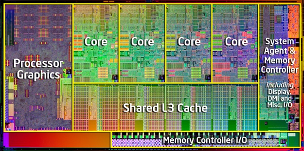

```{r setup, include=FALSE}
knitr::opts_chunk$set(echo = TRUE)
```

## Le processeur
- Est le composant du PC qui effectue les calculs et instructions 
- Il est divisé en coeurs (core)
- un coeur ne peut traiter q'une instruction à la fois
- R utilise par défaut qu'un coeur
- Utiliser plusieurs coeurs peut augmenter la vitesse de calcul




## La paralellisation
- Est un moyen efficace mais situationnel de reduire le temps de calcul
- Repose sur deux packages
```{r ,include=TRUE}
library(foreach)
library(doParallel)
```


## Boucle foreach

## Doparallel

- Bullet 1
- Bullet 2
- Bullet 3

## exemple

```{r, include=TRUE,eval=FALSE}
r <- foreach(icount(n), .combine=cbind) %dopar% {
      ind <- sample(100, 100, replace=TRUE)
      result1 <- glm(x[ind,2]~x[ind,1], family=binomial(logit))
      coefficients(result1)
}
```


